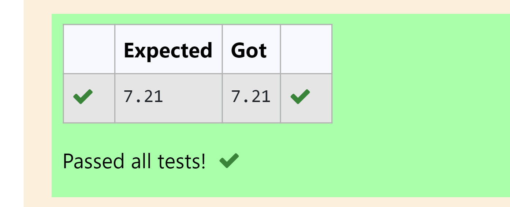

# EXP 1C:DISTANCE-BETWEEN-TWO-POINTS

## AIM:
To write a python program to find the distance two 2 points

## ALGORITHM:
## Step 1:  
Import the math module
## Step 2:  
Get the first point(x1,y1) and second point(x2,y2) in form of list.
## step 3: 
 Substitute the values in the distance formula  
## Step 4: 
 Calculate the distance using the sqrt() function.
## step 5:  
Print the result.

### PROGRAM:
```
#Program to find the distance between two points.
#Developed by: PAVANA G
#RegisterNumber:212222230105

import math
l1=[4,2]
l2=[10,6]
d=math.sqrt(((l2[0]-l1[0])**2)+((l2[1]-l1[1])**2))
print('{:.2f}'.format(d))

```
### OUTPUT:


### RESULT:
Thus the distance between two points is calculated using python program.